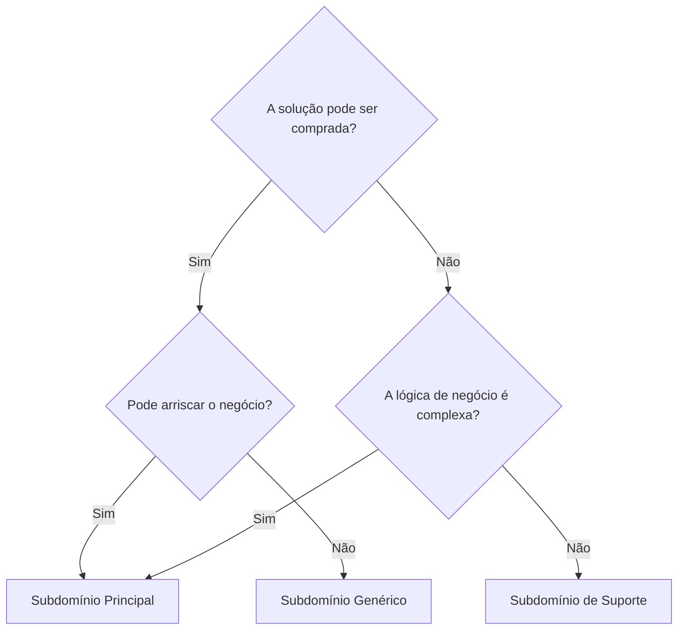

- [Aula de introdução](#aula-de-introdução)
  - [\_O que é DDD](#_o-que-é-ddd)
  - [\_Desafios dos projetos](#_desafios-dos-projetos)
  - [\_Design Estratégico](#_design-estratégico)
    - [Porque e O que](#porque-e-o-que)
    - [O que é o domínio?](#o-que-é-o-domínio)
    - [Podemos separar em 3 tipos de domínios:](#podemos-separar-em-3-tipos-de-domínios)
    - [Subdomínio principal:](#subdomínio-principal)
    - [Subdomínio Genérico](#subdomínio-genérico)
    - [Subdomínio de suporte](#subdomínio-de-suporte)
    - [\_Um mapa que pode ajudar a identificar os subdomínios](#_um-mapa-que-pode-ajudar-a-identificar-os-subdomínios)
  - [\_E quem nos ensina sobre os subdomínios?](#_e-quem-nos-ensina-sobre-os-subdomínios)

# Aula de introdução

## _O que é DDD
- Domain Driven Design
Mecanismo para ajudar a resolver problemas de forma estruturada e de forma que ajude a escalar
ajuda a pensar e esboçar a solução antes de sair escrevendo código, evitando escrever código que cause débitos técnicos

## _Desafios dos projetos
1. Falta de clareza nos objetivos;
    - Precisamos conversar com os stakeholders e entender o problema que iremos resolver.
    - Dependendo do ator que conversamos iremos obter respostas diferentes
2. Scoope Creep;
    - Aquele que não para de mudar o escopo
3. Expectativa irreal
    "isso é fácil, vc faz em 5minutos"
4. Recursos Limitados
5. Falha na Comunicação
    - DDD é muito sobre comunicação
6. Atraso nas Entregas
7. Falta de Transparência

## _Design Estratégico

### Porque e O que
- Gestão Pedagógica
- Gestão Financeira
- Gestão Comunicação
- Gestão Administrativa
- Gestão Recursos Humanos

### O que é o domínio?
- é o coração do software! Vamos desenvolver soluções para o negócio. Mesmo ela sendo permeada por outras coisas.

**Domínio** é o negócio em si, aquilo que a empresa faz, é o motivo dela existir (é o todo).

### Podemos separar em 3 tipos de domínios:
- Subdomínios principais;
- Subdomínios genéricos;
- Subdomínios de suporte;

### Subdomínio principal:

É o negócio que o diferencia dos outros no mercado e possui lógica complexa. Podemos ter **N** subdomínios principais.

O domínio vive dentro de um contexto, poi exemplo:

Para uma escola, o campo de contabilidade não é um subdomínio. Mas se você terceirizar para uma empresa de contabilidade esta tarefa, para esta outra empresa esta tarefa será um subdomínio.

### Subdomínio Genérico

É o que todo mundo faz, atividades  que são comuns no mercado mas que precisam existir para que o negócio funcione.
Por exemplo, o portal da empresa, a loja online, as funções de autenticação e afins. A lógica contida neste tipo de subdomínio é complexa.

### Subdomínio de suporte

Apoia o negócio da empresa, esse não da nenhuma vantagem estratégica para o negócio e "apenas" complementa o que o subdomínio principal faz. Por exemplo, a gestão de dados dos pais dos alunos, integrações com o orgão regulador e etc.

É importante lembrar que cada subdomínio é um negócio e temos que saber o que priorizar. O Subdomínio principal é o dominio que alavanca, os outros são importantes também, mas a princípio precisamos priorizar o principal.

### _Um mapa que pode ajudar a identificar os subdomínios

Apesar de não existir uma regra geral, podemos seguir um fluxo generalista para nos auxiliar a separar os subdomínios.

---

----

## _E quem nos ensina sobre os subdomínios?

Falar com alguém que tenha XP, que domine o processo, que conheça o negócio.
Esta pessoa é a **Domain Expert**. Esta pessoa é quem conta a história, quem escreve os processos e procedimentos.

Enfim, não há uma receita de bolo, uma resposta fechada, temos que considerar muito o trade off, os riscos, o quanto vale a pena no contexto do negócio.
